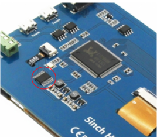
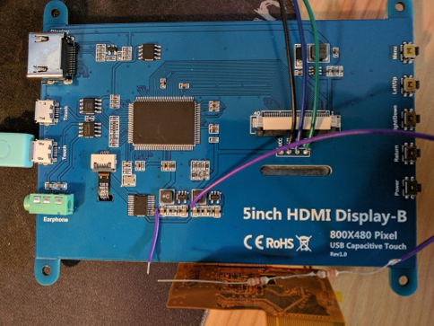
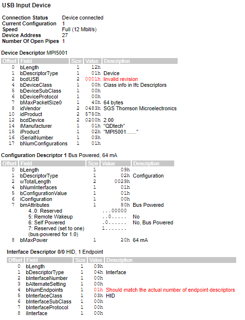
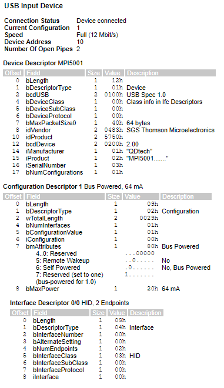

## Fixing the Elecrow 800x480 capacitive touchscreen MPI5001


## Introduction

The Elecrow MPI5001 is an HDMI portable screen powered over USB. With a resolution of 800x480 and a capacitive touchscreen, it's a good product for embedded applications. I ordered it to replace the Adafruit 800x480 HDMI LCD that has a resistive touchscreen that requires strong pressure to work.

Upon reception of the screen, I was able to validate the features and was happy with the menu that allows reducing the brightness and thus adjusting the current consumption.

## Problem:

When connected over USB the device sends out of specs descriptors which can prevent the OS from correctly loading the driver and using the device. After contacting the reseller for a new firmware to fix the issue, I received the answer that the device was compatible with a Raspberry Pi and that it was not supported on other platforms.

Their wiki would not provide any additional information to help me solve the issue: [http://www.lcdwiki.com/5inch_HDMI_Display-B](http://www.lcdwiki.com/5inch_HDMI_Display-B)

I then decided to investigate further and see if I could fix the USB problem.

## Finding the USB microcontroller

In order to understand where this USB descriptor was coming from, I needed to find the component that was acting as the USB device on the PCB. From the USB information, the device declares itself as an STM microcontroller, cf. 0483:5750 from lsusb. On the board, by following the USB tracks, I found a device with a TSSOP20 package. I then realized that all the main Integrated circuits were sanded down on the surface to hide their part numbers and manufacturer information.

I looked for STM microcontrollers in the same package and with USB support and started to compare the pinout.

From the PCB I found the pinout of the power pins (3.3v, ground), two UART pins connected to debug pads, the USB pins and i2c pins from the touch screen IC.

However, when trying to match them to the pinout found in the ST datasheets, I could not find any STM MCU that would match not even the power pins. The same went for MCU from NXP. Even Chinese clones of STM 32 MCU from [Gigadevice](https://www.gigadevice.com/products/microcontrollers/gd32/) that I found would follow the same pinout as the original STM32 and would not match.

After some more googling for cheap Chinese MCU with USB, I finally found one range of MCU that would match the pinout from the PCB for most of the pins: the CH55x from WinChipHead (WCH). 

As the WCH website and datasheet are completely in Chinese, I started looking at other resources related to the CH552 MCU.

I found a few blogs in English talking about the chip as it is very cheap (as low as 30cents):
* [https://www.electrodragon.com/w/WCH#MCU_.2B_USB_CH55x_Series](https://www.electrodragon.com/w/WCH#MCU_.2B_USB_CH55x_Series)
* [https://www.eevblog.com/forum/microcontrollers/lt30-cent-mcu-with-usb-controllers-capactive-touch-more-wchs-ch55x-series/](https://www.eevblog.com/forum/microcontrollers/lt30-cent-mcu-with-usb-controllers-capactive-touch-more-wchs-ch55x-series/)

There is also a small community developing an open-source SDK and programmer
* Sdk: [https://github.com/Blinkinlabs/ch554_sdcc](https://github.com/Blinkinlabs/ch554_sdcc)
* ISP: [https://github.com/rgwan/librech551/](https://github.com/rgwan/librech551/)
* ISP in python: [https://github.com/juliuswwj/wchprog](https://github.com/juliuswwj/wchprog)

and a few example applications provided by the manufacturer:
* [http://www.wch.cn/bbs/thread-65023-1.html](http://www.wch.cn/bbs/thread-65023-1.html)
* [https://bitbucket.org/e_dragon/wch/src/master/](https://bitbucket.org/e_dragon/wch/src/master/)

I found that all the CH55x come with a bootloader that allows serial and USB firmware update. 

The datasheet seemed to specify that you need to pull the reset pin up at power on. To enter the bootloader but in the end, I found from the DIY forums and PCB files that it is the pin USB+ (3.6) that need to be pulled up to 3.3V when powered-on.

After soldering a resistor and an extension wire, I was able to enter the USB bootloader. The device appears as a new peripheral from lsusb:
```
Bus 003 Device 059: ID 4348:55e0 WinChipHead.
```
This confirmed that the chip was an MCU from WCH.



On the picture, you can see the prog pin (3.6) with a small wire and a set of resistors connected the 3.3V line. To enter the bootloader, pull the pin 3.6 to 3.3V, plug the USB cable and release the pin.

Soon after, I modified the librech551 flasher program to only read information from the device not to perform any erase or program operation as I didn't want to lose the original program.

Output from librech551:
```
Detected device CH552
Device rom capacity 16384, data flash capacity 128
Device bootloader version: 1.1
```

Now that I had identified the WCH522, I had to options to fix the invalid USB descriptor: either find a way to dump the program binary, to fix the binary itself, or write a new firmware from scratch.

## Resources to rewrite a firmware

From here, two options were open to me: either I can modify the existing firmware to fix the problem which could be quick fast but requires read access to the WCH program memory or I rewrite a firmware from scratch. I started gathering resources for this second option here, but in the end, I didn’t have to use them.

Software library: 

USB to I2c bitbang: [https://github.com/Blinkinlabs/ch554_sdcc/tree/master/examples/usb_device_cdc_i2c](https://github.com/Blinkinlabs/ch554_sdcc/tree/master/examples/usb_device_cdc_i2c)

Stm code to interface with GT811 (capacitive touch chip)

[https://github.com/pysco68/waveshare-hid](https://github.com/pysco68/waveshare-hid)

## Hacking the WCH552

While going through a German [forum](https://www.mikrocontroller.net/topic/462538) I found a thread discussing the WCH bootloader. They were working on making an open-source flasher application and by analyzing the bootloader firmware, they found a way to read the program memory by hacking the program verify function.

This function receives a block of memory as an argument, compares it with the actual flash program memory and returns a boolean indicating if the data matches or differs. As this function can take a block as small as 8 bytes, and allow to specify the start address arbitrarily, it is possible to use it to recover the whole memory as long as you start from a known block. As it happens, when erased, the flash memory is read as FF, so it is easy to find a block of 8 consecutive FF bytes, for example at the end of the bootloader firmware. From there, you can shift the block by one byte and run a brute-force attack on the new byte. Now, you just have 256 tries to find the correct memory value. Finally, you repeat the process going through all the memory to dump the entire program memory.

This is the method that is implemented by the freader([source](https://www.mikrocontroller.net/attachment/415416/freader.zip), [bin](https://www.mikrocontroller.net/attachment/415854/freader-2.zip)) program (see the German forum for updates)

## Getting the Original firmware

Before fixing the firmware, I wanted to ensure I had a unit test working that would download the firmware, erase the chip and flash again the same code. Failure to do so would make debugging future modification of the binary firmware more complex.

So I downloaded the full program memory of the LCD WCH552. I separated the bootloader part and kept only the first 16kB (it is easy to distinguish the code from the empty memory filled with FF).

I then used [srecord](http://srecord.sourceforge.net/) to convert the binary file of the firmware to an Intel-hex file (.hex).

Then I flashed the LCD again with the program and the LCD did not start: it was not recognized as a USB device.
```
.\srec_cat.exe .\firmware_fixed.bin -Binary -Output firmware_fixed.hex -Intel -address-length=2
```
Hopefully, I was still able to enter the bootloader, but something was wrong with the way I programmed or dumped the firmware.

I then compared the behaviour with then hex file of a simple USB hello world program that is provided by WCH. I was able to program and run it successfully.

I then dumped the program memory again and compared the memory with what I would expect from the hex file. By doing so, I found that the memory at address 0 was not correctly dumped. This turns out to be a bug in the freader program.

I then figured that the first instruction on the first two bytes is always a jump that starts with a 0x02. So I replaced the invalid byte by 0x02 and I was able to successfully rerun the original LCD touchscreen firmware.

Tools:

Analyzing hex using: [https://mh-nexus.de/en/hxd/](https://mh-nexus.de/en/hxd/)

Disassemble the program with [https://www.spicelogic.com/Products/8051-disassembler-1](https://www.spicelogic.com/Products/8051-disassembler-1)

Program the CH552 chip with the official programmer: [WCHISPTool](http://wch.cn/download/WCHISPTool_Setup_exe.html) 

## Fixing the firmware by editing the binary dump:

Now, I dug deeper into the [USB specifications](https://www.beyondlogic.org/usbnutshell/usb5.shtml) to fix the error.

I used the Windows tool [USBlyzer](http://www.usblyzer.com/) to understand the USB errors and I found two:

* In the USB device descriptor the USB revision (bcdUSB) is set to 0.01 (0x01 0x00) but it should be 1.00 (0x00 0x01)
* In the Interface descriptor, the value bNumEndpoints is 1 but should be 2 as the device shows two endpoints.

In the firmware, those values are directly saved as binary arrays so it is very easy to find and fix them.

Here are the results from USBlyzer before and after fixing the firmware:

- Before:                            


- After:



